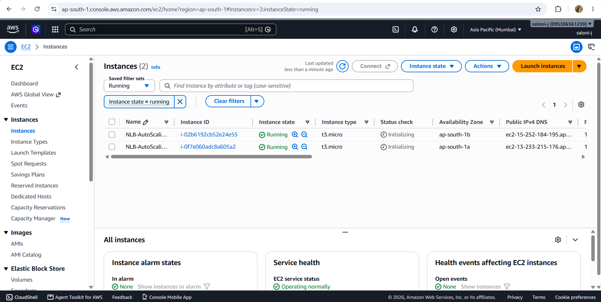
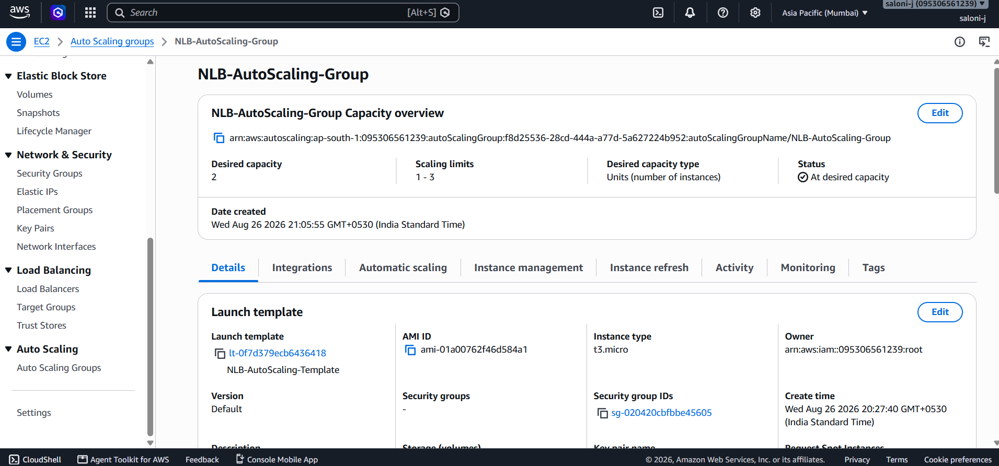
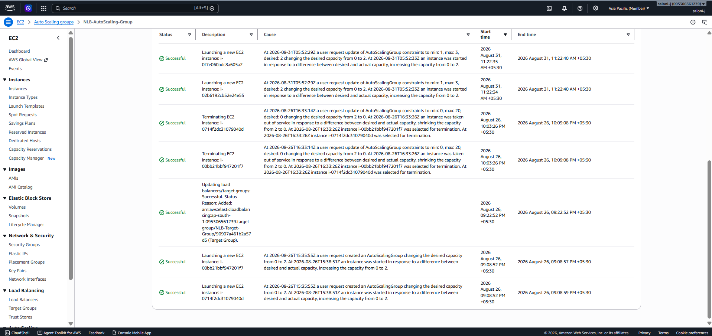
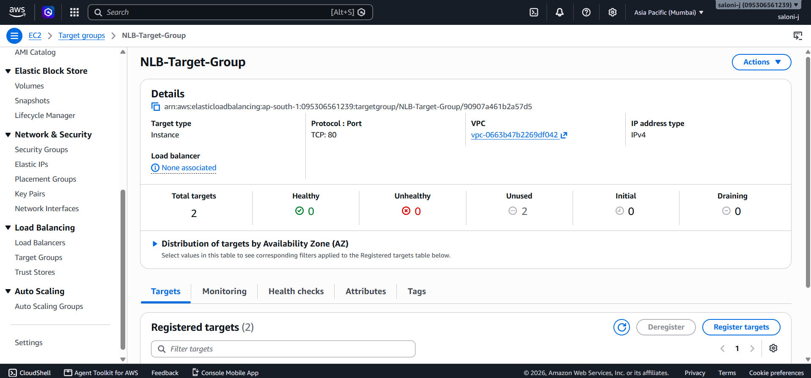

# Scalable Web Application Using NLB and Auto Scaling

## Project Overview

This project demonstrates the deployment of a scalable Flask web application on Amazon Web Services (AWS) using Amazon EC2, an EC2 Launch Template, an Auto Scaling Group, a Target Group, and Amazon VPC networking.

The Flask application was configured to run on EC2 instances. An Auto Scaling Group was created to manage multiple EC2 instances across different Availability Zones. A Target Group was also created to register the EC2 instances on TCP port 80.

The project also included an attempt to create a Network Load Balancer (NLB). However, NLB creation was blocked by an AWS account-level restriction:

`OperationNotPermittedException: This AWS account currently does not support creating load balancers.`

Therefore, the Auto Scaling and Target Group portions were successfully configured and tested, while the final NLB creation could not be completed because of the AWS account restriction.

---

## 1. Project Title and Objective

### Project Title

**Scalable Web Application Using NLB and Auto Scaling**

### Main Objective

The main objective of this project is to demonstrate how a web application can be deployed using Amazon EC2 and managed using Auto Scaling across multiple Availability Zones.

### Specific Objectives

- Deploy a Flask-based web application on EC2.
- Create a reusable EC2 Launch Template.
- Create an Auto Scaling Group.
- Configure minimum, desired, and maximum instance capacity.
- Run multiple EC2 instances across Availability Zones.
- Create a Target Group.
- Configure TCP traffic on port 80.
- Configure health checks for the target group.
- Understand how Auto Scaling manages EC2 instances.
- Attempt to configure a Network Load Balancer.
- Understand scalable and highly available cloud architecture.
- Document the project using Git and GitHub.

### What the Project Demonstrates

The project demonstrates the basic concepts of:

- EC2-based application deployment
- Auto Scaling
- Launch Templates
- Target Groups
- Availability Zones
- TCP-based load balancing architecture
- AWS networking
- Git and GitHub project documentation

---

## 2. AWS Services and Technologies Used

### AWS Services

| AWS Service | Purpose |
|---|---|
| Amazon EC2 | Hosts the Flask web application |
| EC2 Launch Template | Stores the configuration used to launch EC2 instances |
| Auto Scaling Group | Manages and maintains the required number of EC2 instances |
| Target Group | Registers EC2 instances as targets on TCP port 80 |
| Network Load Balancer | Planned to distribute TCP traffic, but could not be created because of an AWS account restriction |
| Security Groups | Controls network traffic to the EC2 instances |
| Amazon VPC | Provides the networking environment for the resources |

### Technologies

| Technology | Purpose |
|---|---|
| Python | Programming language used for the application |
| Flask | Web framework used to create the web application |
| pip | Used for Python dependency installation |
| Git | Version control |
| GitHub | Project repository and documentation |
| Visual Studio Code | Used for project development and Git operations |
| PowerShell | Used for Git commands |

---

## 3. Architecture

### Planned Architecture

```text
                         Internet
                            |
                            v
                Network Load Balancer
                       TCP : 80
                            |
                            v
                     Target Group
                            |
                 +----------+----------+
                 |                     |
                 v                     v
          EC2 Instance 1       EC2 Instance 2
          ap-south-1a          ap-south-1b
                 |                     |
                 +----------+----------+
                            |
                            v
                    Flask Application
                            |
                            v
                    Auto Scaling Group
```

### Architecture Explanation

The intended architecture uses a Network Load Balancer as the entry point for TCP traffic.

The NLB would forward traffic to the Target Group. The Target Group contains EC2 instances running the Flask application.

The EC2 instances are managed by an Auto Scaling Group. The Auto Scaling Group can maintain the required number of instances and launch or terminate instances according to its configured capacity.

Two Availability Zones were used for the Auto Scaling Group:

- `ap-south-1a`
- `ap-south-1b`

The Network Load Balancer could not be created because the AWS account returned an `OperationNotPermittedException`.

---

## 4. Project Workflow

```text
START
  |
  v
Create Flask Application
  |
  v
Create EC2 Launch Template
  |
  v
Create Auto Scaling Group
  |
  v
Configure Desired / Minimum / Maximum Capacity
  |
  v
Launch EC2 Instances
  |
  v
Verify EC2 Status Checks
  |
  v
Create Target Group
  |
  v
Register EC2 Instances
  |
  v
Configure TCP : 80
  |
  v
Attempt Network Load Balancer Creation
  |
  v
AWS Account Restriction
  |
  v
Document Result
  |
  v
GitHub Repository
  |
  v
END
```

### Workflow Explanation

1. A Flask web application was prepared.
2. An EC2 Launch Template was created.
3. An Auto Scaling Group was created using the Launch Template.
4. The Auto Scaling Group was configured with a desired capacity of 2 and scaling limits of 1–3 during the project execution.
5. EC2 instances were launched across two Availability Zones.
6. The EC2 instances successfully passed their status checks.
7. A Target Group named `NLB-Target-Group` was created.
8. The EC2 instances were registered with the Target Group on TCP port 80.
9. Creation of the Network Load Balancer was attempted.
10. AWS blocked the operation because the account did not support creating load balancers.
11. Screenshots and project files were documented in the GitHub repository.

---

## 5. Project Structure

```text
AWS-NLB-AutoScaling/
│
├── app/
│   ├── app.py
│   └── requirements.txt
│
├── screenshorts/
│   ├── activity-history.png
│   ├── desktop.ini
│   ├── ec2-running.png
│   ├── launch templatte.png
│   ├── nlb-scalling-group.png
│   └── target-group-details.png
│
└── README.md
```

### Important Files and Folders

| File/Folder | Purpose |
|---|---|
| `app/app.py` | Flask application code |
| `app/requirements.txt` | Python dependencies required by the application |
| `screenshorts/` | Project documentation screenshots |
| `README.md` | Project documentation |

> Note: The folder is currently named `screenshorts` in the GitHub project, so the README uses that exact folder name.

---

## 6. Implementation Steps

### 6.1 Flask Application

A Flask-based web application was created in:

```text
app/app.py
```

The Python dependencies were listed in:

```text
app/requirements.txt
```

### 6.2 EC2 Launch Template

An EC2 Launch Template named:

```text
NLB-AutoScaling-Template
```

was created.

The Launch Template used:

- Instance type: `t3.micro`
- Key pair: `NLB-AutoScaling-Key`
- AMI: `ami-01a00762f46d584a1`
- Security group: `sg-020420cbfbbe45605`

### 6.3 Auto Scaling Group

An Auto Scaling Group named:

```text
NLB-AutoScaling-Group
```

was created using the Launch Template.

The Auto Scaling Group was configured to use:

```text
Desired capacity: 2
Minimum capacity: 1
Maximum capacity: 3
```

Two Availability Zones were selected:

```text
ap-south-1a
ap-south-1b
```

### 6.4 EC2 Instances

The Auto Scaling Group successfully launched EC2 instances.

The instances used:

```text
Instance type: t3.micro
```

The instances successfully reached:

```text
Running
3/3 checks passed
```

### 6.5 Target Group

A Target Group named:

```text
NLB-Target-Group
```

was created with:

```text
Target type: Instance
Protocol: TCP
Port: 80
IP address type: IPv4
```

The EC2 instances were registered as targets.

### 6.6 Network Load Balancer

A Network Load Balancer named:

```text
NLB-Scalable-Web-App
```

was attempted.

The configuration used:

```text
Scheme: Internet-facing
IP address type: IPv4
Listener: TCP : 80
Target Group: NLB-Target-Group
```

However, AWS returned:

```text
OperationNotPermittedException:
This AWS account currently does not support creating load balancers.
```

Therefore, the NLB could not be created.

### 6.7 Auto Scaling Verification

The Auto Scaling Activity History showed successful instance launch activities.

The project also demonstrated changing the Auto Scaling Group capacity.

For cost control after the documentation was completed, the Auto Scaling Group capacity was reduced to:

```text
Desired capacity: 0
Minimum capacity: 0
Maximum capacity: 3
```

---

## 7. Configuration

### AWS Region

```text
ap-south-1
```

Mumbai Region

### VPC

```text
vpc-0663b47b2269df042
```

### Availability Zones

```text
ap-south-1a
ap-south-1b
```

### Auto Scaling Group

```text
Name: NLB-AutoScaling-Group
Desired capacity: 2
Minimum capacity: 1
Maximum capacity: 3
```

### Launch Template

```text
Name: NLB-AutoScaling-Template
Instance type: t3.micro
Key pair: NLB-AutoScaling-Key
```

### Target Group

```text
Name: NLB-Target-Group
Target type: Instance
Protocol: TCP
Port: 80
IP address type: IPv4
```

### Health Checks

The Target Group was configured to use:

```text
Health check protocol: HTTP
Health check path: /
Health check port: Traffic port
```

### Security

Security Groups were used to control network traffic to the EC2 instances.

No AWS access keys, secret keys, passwords, or other credentials are included in this repository.

---

## 8. How to Run the Project

### Prerequisites

The following are required:

- AWS account
- AWS Console access
- Amazon EC2 access
- Python
- Flask
- Git
- Visual Studio Code
- Internet connection

### Project Files

Clone the GitHub repository and open the project folder.

```text
AWS-NLB-AutoScaling/
```

### Python Dependencies

The required Python dependencies are listed in:

```text
app/requirements.txt
```

Install the dependencies using:

```powershell
pip install -r app/requirements.txt
```

### Run the Flask Application

The Flask application is located at:

```text
app/app.py
```

The exact deployment command used for the EC2 environment is:

```text
[TO BE ADDED]
```

If the application is being run locally, the exact command should be added based on the actual command used during the project.

> No command is invented here because the exact application execution command was not provided.

### AWS Deployment

The AWS deployment used:

1. EC2
2. Launch Template
3. Auto Scaling Group
4. Target Group

The Network Load Balancer portion could not be completed because of the AWS account restriction.

---

## 9. Deployment / Execution Output

### EC2 Instance Verification

The EC2 instances successfully reached:

```text
Running
3/3 checks passed
```

This indicates that the launched EC2 instances successfully passed the available EC2 status checks.

### Auto Scaling Activity

The Auto Scaling Activity History showed successful instance launch operations.

The activity history confirmed that the Auto Scaling Group launched instances to satisfy the configured desired capacity.

### Network Load Balancer Result

The Network Load Balancer creation attempt returned:

```text
OperationNotPermittedException:
This AWS account currently does not support creating load balancers.
```

This prevented the final NLB-based traffic distribution stage from being completed.

---

## 10. Screenshots

### Screenshot 1 – EC2 Instances



Shows the EC2 instances launched for the Auto Scaling project and their running status and health checks.

### Screenshot 2 – Launch Template


Shows the configuration of the `NLB-AutoScaling-Template`.

### Screenshot 3 – Auto Scaling Group



Shows the configuration of the `NLB-AutoScaling-Group`, including its capacity settings.

### Screenshot 4 – Auto Scaling Activity



Shows successful Auto Scaling activities, including EC2 instance launch operations.

### Screenshot 5 – Target Group



Shows the `NLB-Target-Group` configuration and registered EC2 targets.

---

## 11. Testing and Results

| Test | Expected Result | Actual Result | Status |
|---|---|---|---|
| EC2 instance launch | EC2 instances should launch successfully | Instances launched successfully | PASS |
| EC2 status checks | Instances should pass status checks | 3/3 checks passed | PASS |
| Auto Scaling Group | ASG should maintain configured capacity | ASG launched instances successfully | PASS |
| Target Group creation | Target Group should be created | Target Group created successfully | PASS |
| Target registration | EC2 instances should be registered | 2 EC2 instances registered | PASS |
| NLB creation | NLB should be created | AWS account restriction prevented creation | BLOCKED |

### Overall Result

The EC2, Launch Template, Auto Scaling Group, and Target Group components were successfully configured.

The Network Load Balancer could not be created because the AWS account did not support creating load balancers.

---

## 12. Key Learnings

Through this project, the following concepts were learned:

### AWS Concepts

- Amazon EC2 instance deployment
- EC2 Launch Templates
- Auto Scaling Groups
- Availability Zones
- Target Groups
- Network Load Balancer architecture
- Amazon VPC networking

### Cloud Computing Concepts

- Scalability
- High availability
- Resource management
- Distributed application architecture

### Programming Concepts

- Python
- Flask web application development
- Python dependency management

### Security Concepts

- Security Groups
- Key pairs
- Basic AWS resource security

### Automation Concepts

- Auto Scaling automatically launches and manages EC2 instances based on configured capacity.

### Git/GitHub Concepts

- Git repository initialization
- Adding files to Git
- Creating commits
- Pushing project files to GitHub
- Maintaining project documentation

---

## 13. Advantages

- Demonstrates cloud-based application deployment.
- Demonstrates EC2 Auto Scaling.
- Uses multiple Availability Zones.
- Provides a reusable EC2 Launch Template.
- Demonstrates Target Group configuration.
- Helps understand scalable cloud architecture.
- Provides practical experience with AWS.
- Project files and documentation are maintained using Git and GitHub.

---

## 14. Limitations

- The Network Load Balancer could not be created because the AWS account did not support load balancer creation.
- Therefore, actual traffic distribution through the NLB could not be demonstrated.
- The final end-to-end NLB-to-target traffic test could not be performed.
- The project currently demonstrates the Auto Scaling and Target Group components separately from the NLB.

---

## 15. Future Enhancements

The following improvements can be added in the future:

- Create and attach a Network Load Balancer after the AWS account restriction is resolved.
- Test TCP traffic distribution through the NLB.
- Configure additional Auto Scaling policies.
- Add CloudWatch-based monitoring and alarms.
- Improve application deployment automation.
- Add more detailed application functionality.
- Add automated testing.
- Add additional security and monitoring configurations.

---

## 16. Conclusion

This project successfully demonstrated the deployment and management of a Flask web application using Amazon EC2, an EC2 Launch Template, an Auto Scaling Group, and a Target Group.

Multiple EC2 instances were successfully launched across different Availability Zones and passed their EC2 status checks. The Target Group was successfully created and configured for TCP traffic on port 80.

A Network Load Balancer was also configured as part of the intended architecture, but its creation was blocked by an AWS account-level restriction. Despite this limitation, the project provided practical experience with EC2, Auto Scaling, Target Groups, AWS networking, scalability, and Git/GitHub documentation.

---

## 17. Viva / Interview Summary

### What is the project?

This project demonstrates a scalable Flask web application architecture using EC2, Auto Scaling, Target Groups, and a planned Network Load Balancer.

### What is the objective?

The objective is to understand how a web application can be deployed across multiple EC2 instances and managed using Auto Scaling.

### Why was EC2 used?

EC2 was used to host the Flask web application.

### Why was Auto Scaling used?

Auto Scaling was used to manage multiple EC2 instances and maintain the required instance capacity.

### Why was a Launch Template used?

The Launch Template provides a reusable configuration for launching EC2 instances with the required settings.

### Why was a Target Group used?

The Target Group was created to register EC2 instances as targets for load balancing.

### Why was an NLB used?

A Network Load Balancer was planned to distribute TCP traffic to the registered EC2 instances.

### What was the main challenge?

The main challenge was that the AWS account did not permit the creation of Network Load Balancers, resulting in an `OperationNotPermittedException`.

### What did you learn?

I learned how to deploy EC2 instances, create Launch Templates and Auto Scaling Groups, configure Target Groups, work with Availability Zones, understand load balancing architecture, and manage a project using Git and GitHub.

---

## GitHub Repository

[TO BE ADDED]
